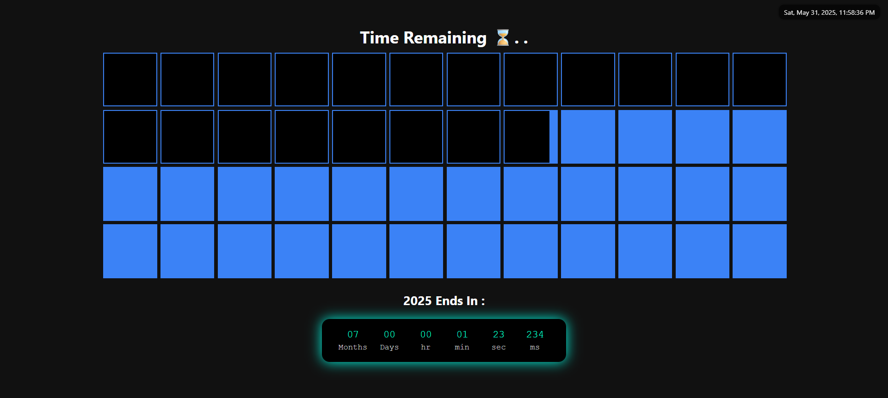

# 🗓️ Dynamic Year Countdown Calendar

This project visually represents the **progress of the current year (2025)** through a grid of boxes (48 total), each indicating a fraction of the year (approximately a week). It also includes a **real-time countdown timer** to the end of the year along with a **live date-time display**.

---

## 🌟 Features

- ✅ **48 Box Grid** representing the year
  - Boxes turn black for past weeks
  - Current box shows partial fill indicating progress through the current week
- 🕒 **Countdown Timer** to the end of the year
  - Months, Days, Hours, Minutes, Seconds, Milliseconds
- 📆 **Live Date-Time Display**
  - Neatly displayed at the top-right corner
- 🎨 **Dark UI Theme** with glowing timer box

---

## 📸 Preview:

 <!-- Replace this with your actual screenshot if available -->

---

## 🔗 Live Demo

👉 [Click here to view the calendar live][(https://dynamic-year-calendar-git-main-priyatosh-deys-projects.vercel.app)](https://dynamic-year-calendar-git-main-priyatosh-deys-projects.vercel.app)

## 📁 File Structure

```plaintext
.
├── index.html   # The main file with HTML, CSS, and JS
└── README.md    # Project documentation
